# 🐺 Wolf · Wildnis & Rudel

[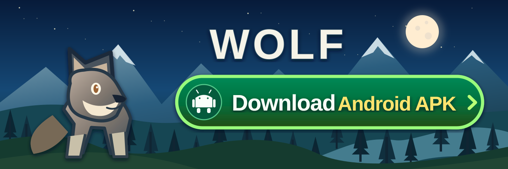](https://github.com/chekento/wolf/releases/latest/download/Wolf-android.apk)

### 📱 [**Download Android APK – Wolf 0.12.2 direkt herunterladen**](https://github.com/chekento/wolf/releases/latest/download/Wolf-android.apk)

[🇬🇧 Download latest Android APK](https://github.com/chekento/wolf/releases/latest/download/Wolf-android.apk) · [Alle Releases / All releases](https://github.com/chekento/wolf/releases)

[](https://github.com/chekento/wolf/releases/latest/download/Wolf-android.apk)
[](CHANGELOG.md)
[](https://godotengine.org/)

**[🇩🇪 Deutsch](#-deutsch) · [🇬🇧 English](#-english)**

**Neu in 0.12.2 / New in 0.12.2:** Willkommensinfos jetzt direkt über den Text scrollen; oben Hunger, Durst, Kraft und Rudel stets als Zahlen mit Minibalken; vier praktische Aktionen ein-/ausklappbar, Rudel und Geschichte in einer schmalen untersten Zeile. / Scroll by dragging anywhere across welcome cards, always-visible numeric compact stats, collapsible four-action tray and discreet pack/story utility buttons.

**0.12.1:** Multitouch: unabhängige Finger für Joystick, 3D-Kamerablick, gleichzeitig erreichbare Aktionstasten und Sprint/Leise, mit Finger-ID-Verfolgung und zuverlässigem Abbruch bei Menüwechsel oder App-Wechsel. In Menüs bleibt das normale Tippen und Scrollen erhalten. / Independent multitouch finger ownership for stick, 3D look, action taps and movement toggles; gesture cleanup on pause/menu, normal menu scrolling preserved.

**0.12.0:** Ein wirklich schmaler, aufklappbarer Statusstreifen ersetzt den alten hohen Kopfbereich. Die vollständige Karte, Bedürfnisse und Begegnungen sind erst beim Aufklappen sichtbar. Die untere Steuerung bietet sechs feste Aktionen (Nase, Aktion, Heulen, Ruhen, Rudel, Geschichte) und vier Navigationstasten. Kleinere Telefone erhalten angepasste Beschriftungen und einen korrekt skalierten Touch-Joystick. / A true one-line foldable status ribbon, six permanent gameplay actions, responsive joystick and compact labels on small screens.


> **Wichtiger Installationshinweis / Important install note:** GitHub Actions uses an ephemeral Android debug signing key. A newly downloaded APK cannot update a locally signed 0.10.0 install without a matching certificate. Keep your existing install/save until a same-key release is available. / GitHub Actions verwendet einen temporären Debug-Schlüssel. Die bestehende 0.10.0 für den Spielstand behalten, statt sie ohne Sicherung zu deinstallieren.

**Neu in 0.11.0:** Optionales gemeinsames Rudelspiel über **Deine Familie**. Nahe Geschwister und Eltern laufen tatsächlich zu freien Spielpositionen, zeigen ihre Spielhaltung und hören auf, wenn du fortläufst. / **New in 0.11.0:** Invite nearby family members to play; they approach using real movement and stop when you leave.


> **APK-Download / APK download:** Der Banner und der Textlink oben laden die **Android-APK direkt** vom neuesten GitHub-Release herunter – ohne ZIP-Entpacken und ohne Workflow-Navigation. / The banner and text link above download the **Android APK directly** from the latest GitHub Release.

---

# 🇩🇪 Deutsch

## Ein Wolfleben zwischen spielbarer 2D-Karte und echter 3D-Wahrnehmung

**Wolf · Wildnis & Rudel** ist ein offline spielbarer Android-Prototyp in **Godot 4.5.1**. Du beginnst als **16 Wochen alter Jungwolf** bei Mutter, Vater und zwei Geschwistern und erschließt deine Heimat über Gerüche, Fährten, Tierbeobachtung, Naturorte und gemeinsame Wege.

Der Kern des Spiels ist die Verbindung zweier Perspektiven derselben Welt:

- **2D-Draufsicht:** frei begehbare, kartig aufgebaute Gebiete mit Bewegung nach oben, unten, links, rechts und diagonal.
- **3D-Wolfsblick:** jederzeit in Bodennähe in die gleiche Szene wechseln, sich umsehen und Tiere, Fährten, Höhenunterschiede und Naturdetails räumlich wahrnehmen.
- **3D-Folgekamera:** den eigenen wachsenden Wolf aus einer dritten Perspektive durch dieselbe Umgebung begleiten.

2D und 3D sind keine getrennten Spiele. Sie teilen **dieselben Tierpositionen, Spuren, Landschaften, Naturorte und Fortschritte**.

## 🌍 Große verbundene Wildnis

Die Welt besteht derzeit aus **256 miteinander verbundenen Gebieten** in einem 16×16-Raster. Jedes Gebiet misst 3200×3200 Welteinheiten und enthält echte Übergänge zu Nachbarregionen.

Die Landschaft umfasst unter anderem:

- Wald
- Wiesen
- Berge
- Schnee
- Küste
- Moor- und Sumpfgebiete
- Flüsse, Seen und Wasserfälle
- Höhlen, Schutzplätze und markante Naturorte

Insgesamt gibt es **1536 benannte Naturorte**, sechs pro Gebiet. Jedes Gebiet enthält Nahrung, Wasser und geschützte Ruheplätze.

Der Wolf kann die Welt nicht per Karten-Teleport überspringen. Wer ein Ziel erreichen will, läuft tatsächlich dorthin und durchquert die verbundenen Regionen.

## 🗺️ 2D als echte Top-Down-Karte

Die 2D-Gebiete sind ausdrücklich **nicht als seitlich scrollende Level** gedacht. Sie funktionieren wie begehbare Karten von oben.

Der Wolf kann sich frei in alle Richtungen bewegen. Wege verzweigen sich, Brücken verbinden Flussufer, Pfade führen nach Norden oder Süden weiter, Naturorte liegen ober- oder unterhalb der aktuellen Position und Übergänge führen in andere Gebiete.

Der **Wildnisatlas** zeigt die große Welt mit Landschaftssymbolen, Höhenlinien, Gewässern, Kompass und Maßstab. Die lokale Detailkarte zeigt tatsächliche Vegetation, Wasser, Höhlen, Naturorte und Tierpositionen.

Antippen kann ein **Duftziel** setzen. Route, Kompass und Pfotenschritte führen über tatsächlich begehbare Wege dorthin.

## 👁️ 3D-Wolfsblick – überall umsehen

An praktisch jedem Ort kann von der Draufsicht in den **3D-Wolfsblick** gewechselt werden.

Aus Bodennähe lassen sich dann dieselben Orte anders lesen:

- Berge und Geländestufen räumlich einschätzen
- Tiere in ihrer Umgebung beobachten
- Fährten und Hinweise untersuchen
- Naturorte aus Augenhöhe erkennen
- Blickrichtung und freie Sicht für Beobachtungsaufgaben nutzen
- Geruchshinweise mit der tatsächlichen Landschaft verbinden

Anschließend kann nahtlos wieder in die 2D-Draufsicht zurückgewechselt werden.

Zusätzlich steht eine **3D-Folgekamera** zur Verfügung, die den eigenen Wolf sichtbar macht und ihren Abstand bei Hindernissen anpasst.

## 🐾 Fährten, Gerüche und Wahrnehmung

Rehe, Hasen und Füchse hinterlassen unterscheidbare Trittsiegel. Schnüffeln macht Spuren sichtbar; eine geübtere Nase verlängert die Zeit, in der sie erkennbar bleiben.

Fährten und Wahrnehmung gehören direkt zum Gameplay. Begegnungen können beispielsweise verlangen:

- eine neue Spur aufzunehmen,
- einen Naturort zu entdecken,
- Wasser zu finden,
- ein Tier aus sicherer Entfernung zu beobachten,
- dasselbe Tier über längere Zeit im Blick zu behalten,
- ein Tier bei zwei unterschiedlichen ruhigen Tätigkeiten zu beobachten,
- einen Naturort zu prüfen und dort den eigenen Duft zu setzen.

Im 3D-Modus zählen tatsächliche Distanz, Blickrichtung und freie Sicht.

## 🐺 Rudelleben

Mutter, Vater und Geschwister besitzen eigene Tagesroutinen. Sie laufen, ruhen, erkunden, spielen und reagieren auf Begrüßung oder gemeinsames Heulen.

Bindung wächst durch echte gemeinsame Erlebnisse. Bei ausreichender Bindung kann die Mutter den Jungwolf über Gebietsgrenzen begleiten.

Die aktuelle Fassung enthält:

- **8 neue Hauptkapitel mit 21 Handlungsschritten**
- **18 zusätzliche Rudelerinnerungen**
- **42 Erlebnisse**
- wiederholbare regionale Wildnisbegegnungen
- mehrere Aufgaben mit tatsächlicher gemeinsamer Ankunft und Tierbeobachtung
- Fortschritt, der nur durch wirklich ausgeführte Aktionen zählt

## 📖 Die Düfte der Heimat

Eine eigene Hauptgeschichte führt von der Höhle über Bergwiese und Flussauen in den Kiefernwald und zurück nach Hause. Begrüße die Mutter, kommt wirklich gemeinsam an, prüfe konkrete Fährten und Naturorte, beobachte dasselbe ruhige Reh und kehre zur gemeinsamen Rast zurück. Kapitel werden bewusst fortgesetzt und genau einmal belohnt; alte Rudelerinnerungen bleiben erhalten.

Schmale, geschwungene Wildwechsel ersetzen die gleichförmigen Kreuzungen. Laub, Nadeln, Gras, Moorboden, Stein, Kies, Sand und Schnee unterscheiden die Wege. Einige laufen aus; vor der Heimathöhle bleibt der Boden ohne sichtbaren Weg.

Die Animationen blenden Gangarten weicher, setzen Pfoten am Boden auf und lassen einen begonnenen Schritt beim Anhalten auslaufen.

## 🌿 Eigene Naturreisen

In jedem Gebiet warten sechs eigenständige Naturreisen: Duftspur, Trinkufer, zwei konkrete Hasentrittsiegel, ruhige Rehbeobachtung, zwei Naturorte und ein geschützter Ruheplatz. Das ergibt **1536 regionale Angebote** neben der Hauptgeschichte. Nimm eine Reise bewusst an, erfülle ihre geordneten Handlungen und erinnere sie anschließend im Menü. Bereits bekannte Orte und Fährten zählen erst durch frische Handlungen; jede Reise belohnt einmal.

Regionale Menübilder, ein eigener Naturreisenbereich und tatsächliche Fortschrittsanzeigen begleiten die neuen Aufgaben. Kleine Laub-, Pilz-, Totholz-, Kräuter-, Kiesel- und Moosgruppen ergänzen den Boden, ohne neue Hindernisse oder veränderte alte Spielpositionen.

## 🦌 Lebendige Tierwelt

Rehe, Hasen, Füchse und Wölfe wählen tatsächliche:

- Futterplätze
- Deckung
- Trinkufer
- Ruheorte

Arten unterscheiden sich in Aufmerksamkeit, Fluchtdistanz und Tagesaktivität.

Tiere können längere Wege vollständig beenden, statt durch einen globalen Zeitwechsel unterbrochen zu werden. Rehe nutzen bei freien Wegen nahe gemeinsame Futterplätze; Fluchtreaktionen können kleine Gruppen erfassen und nach Ende der Gefahr wieder abklingen.

Geschwister wechseln kurze gemeinsame Laufspiele mit echten Ruhepausen ab.

## 🌲 Grafik und Atmosphäre

Die visuelle Richtung verbindet **niedliche, gut lesbare Comic-Grafik** mit glaubwürdiger Natur.

Die Top-Down-Ansicht verwendet Comic-Laufsequenzen, Aktionsposen und Bodenschatten. In 3D besitzen Wolf, Reh, Hase und Fuchs eigene Modelle mit unterschiedlichen Körperformen und beweglichen Gliedmaßen.

Seit Version 0.9.0 gibt es:

- schlankere Schnauzen mit Nasenrücken, Lippen und Nüstern
- gerundete Hasenohren, größere Fuchsohren und kompaktes Rehgeweih
- tiefere Gras- und Trinkposen sowie ruhigere Ruhehaltungen
- elf Arten kleiner Bodenmotive für Wald, Wiese, Ufer, Moor und Schnee
- regionale Menüillustrationen und sechs wählbare Naturreisen je Gebiet

Dazu kommen bewegtes Wasser, Wolken, Mond, Sterne, Regen, Schnee, Nebel und jahreszeitliche Farbänderungen.

Version 0.12.2 korrigiert den seitlichen Versatz bei Wolfaktionen. Die erste Hauptmission verwendet den erreichbaren Höhleneingang und tatsächliche ruhige Mutternähe. Ein kompakter einklappbarer Missionshinweis hält Toasttexte getrennt; Details bleiben über **?** erreichbar. Rudelmitglieder nutzen getrennte körperlich erreichbare Näheziele.

## 📸 Echte Spielaufnahmen

Die folgenden Bilder stammen aus dem tatsächlich laufenden Godot-Prototyp.

| 2D-Draufsicht | 3D-Folgekamera |
|---|---|
| 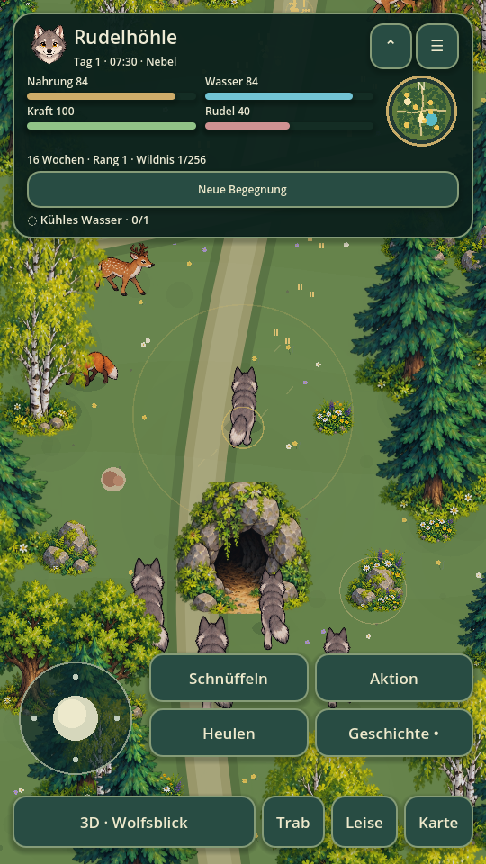 | 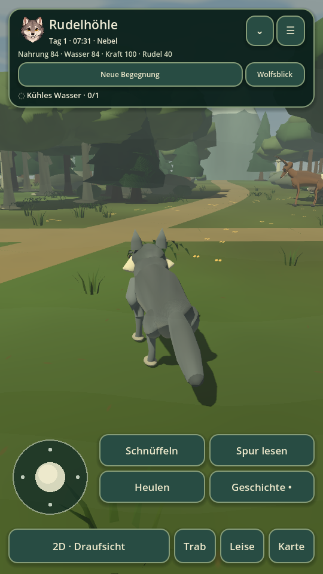 |

| 3D-Wolfsblick | Wildnisatlas |
|---|---|
| 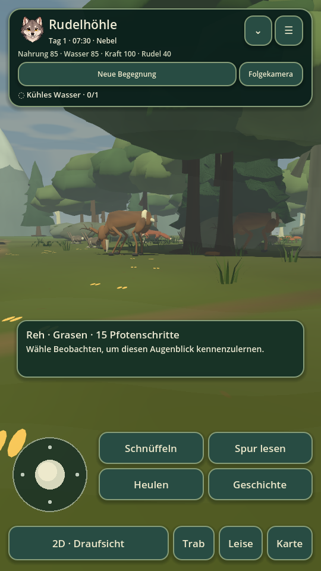 | 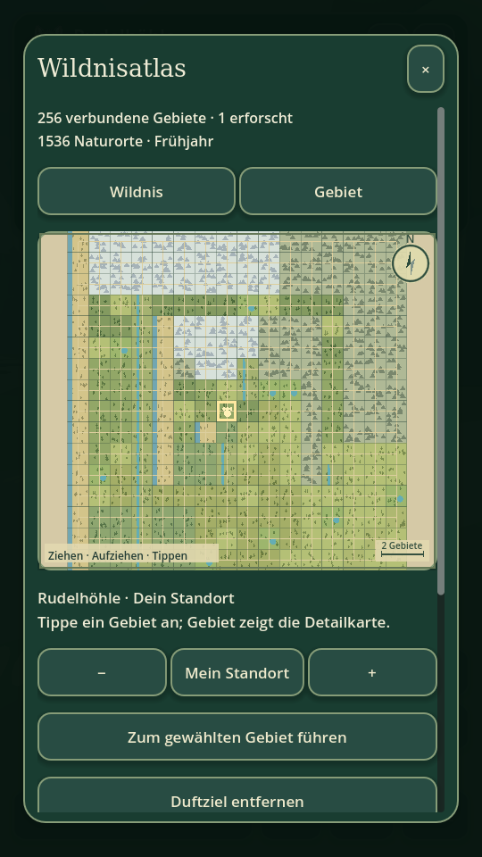 |

| Hauptgeschichte | Ruhige Beobachtung |
|---|---|
| 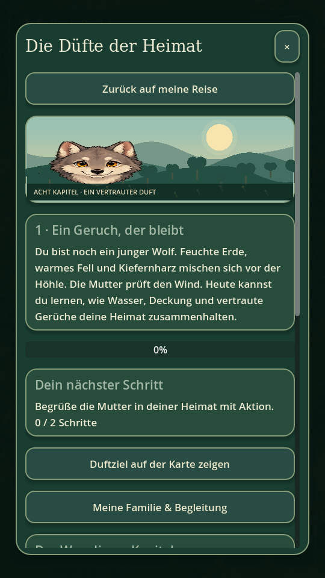 | 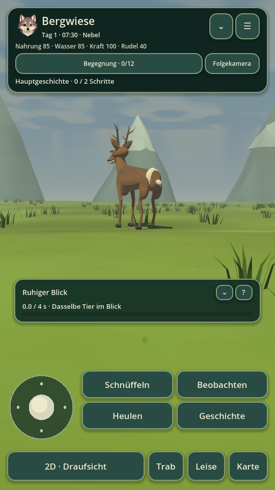 |

| Naturreisen | Aktive Naturreise |
|---|---|
| 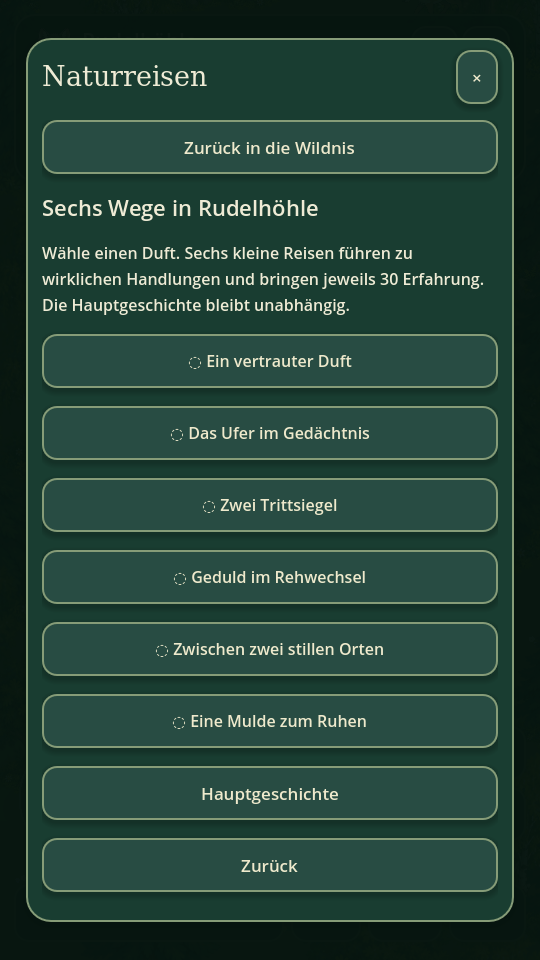 | 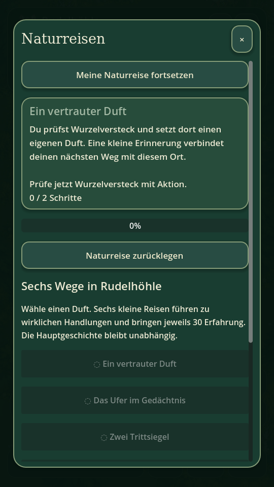 |

| Kompakte Mission mit Hinweis | Vollständige Missionsdetails |
|---|---|
| 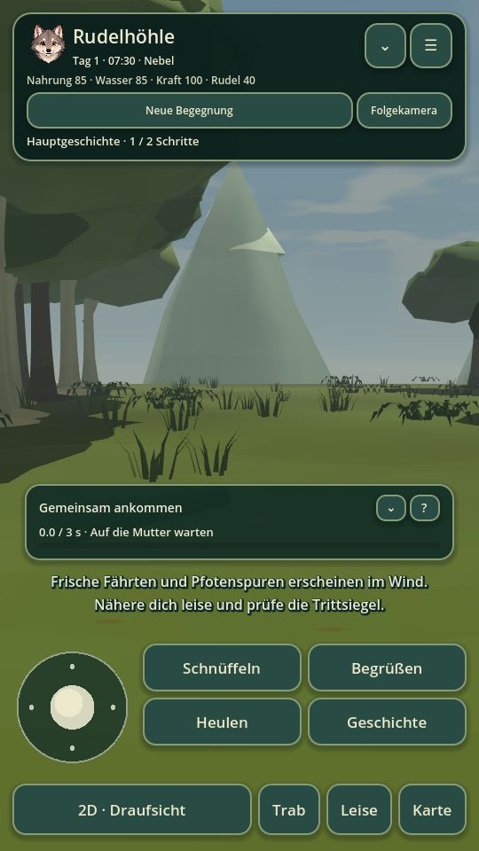 | 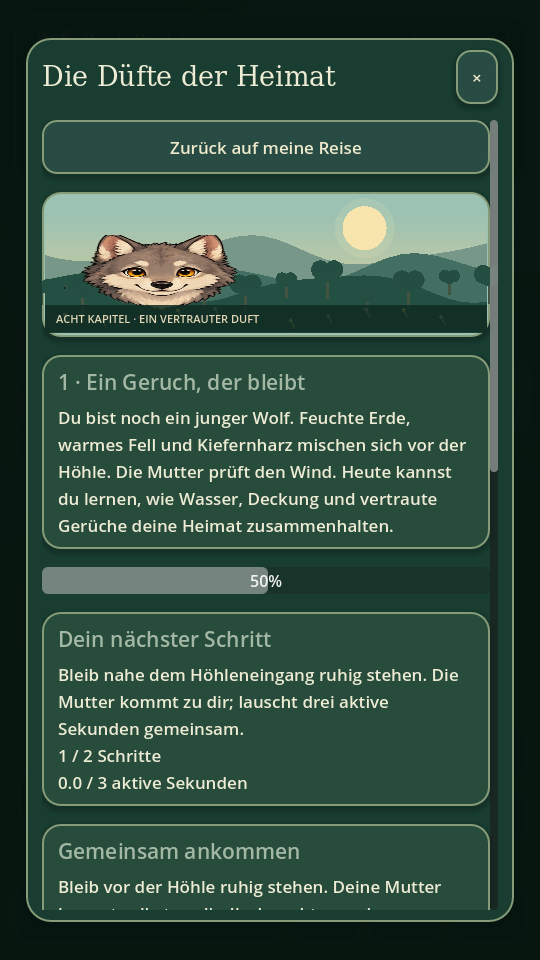 |

| Rudel in 3D | Begegnung |
|---|---|
| 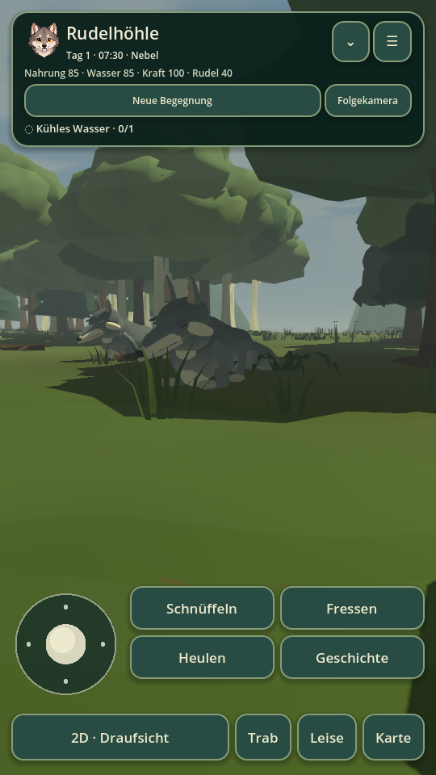 | 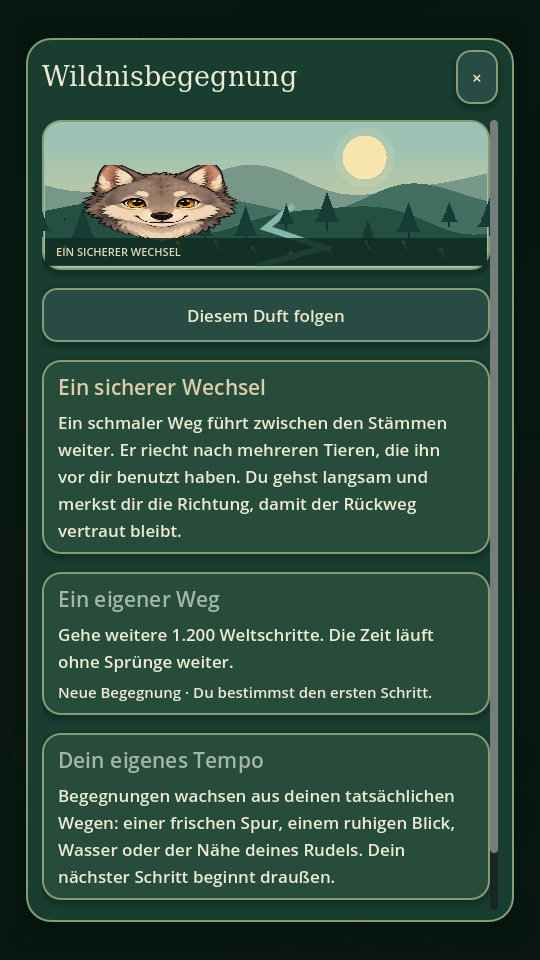 |

Die folgenden kontrollierten Nahansichten zeigen die tatsächlichen neuen Spielmeshes in einer separaten Godot-Testszene.

| Wolfsmodell | Reh beim Grasen |
|---|---|
| 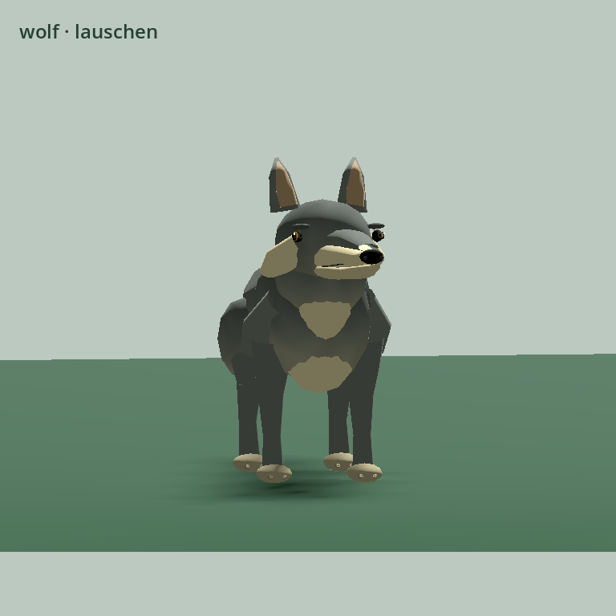 | 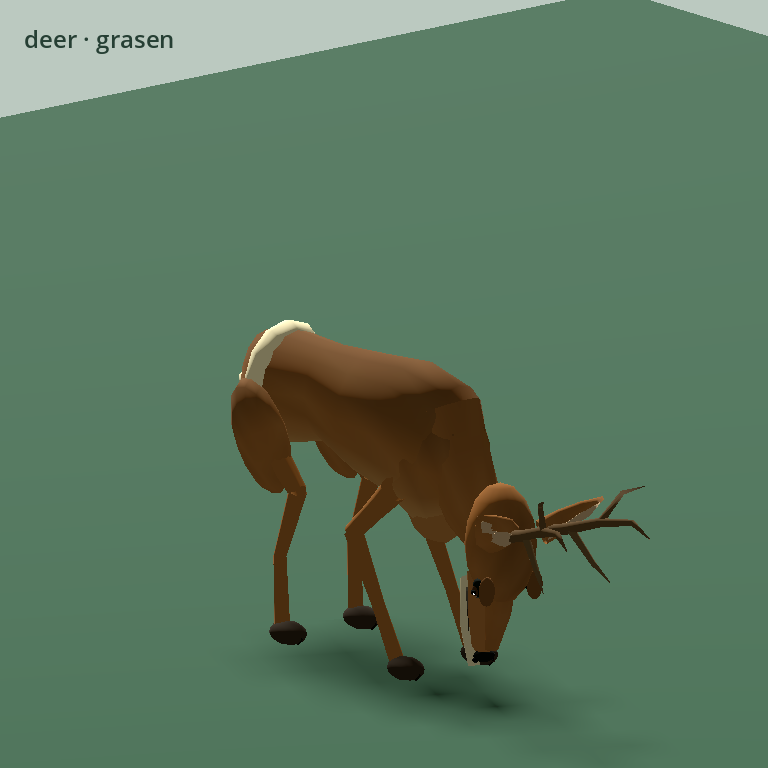 |

### Visuelle Zielrichtung

Die zuletzt entwickelten zehn Hochkant-Konzeptbilder dienen als Zielbild für die nächste Ausbaustufe der Android-Oberfläche: **stärker kartige Top-Down-Gebiete, Bewegung in alle Richtungen, dichter illustrierte Biome, klarere Touch-Bedienung und ein jederzeit sichtbarer Wechsel in die 3D-Ansicht.**

## 🌦️ Tageszeit, Wetter und Wachstum

Ein Spieltag dauert **60 Minuten aktive Spielzeit**. Menüs und App-Hintergrund pausieren die Entwicklung.

Der Wolf wächst langsam in Alter und Körpergröße. Jahreszeiten wechseln nach jeweils 30 Spieltagen. Ruhen überspringt keine kompletten Tage.

Wetter, Licht und Umgebung verändern die Atmosphäre über:

- Tag und Nacht
- Regen
- Schnee
- Nebel
- Mondlicht
- jahreszeitliche Farben

## 🎮 Steuerung

| Aktion | Android | Computer |
|---|---|---|
| Bewegen | Pfotenstick, frei in alle Richtungen | WASD / Pfeile |
| 3D umsehen | Landschaft wischen | Maus / I J K L |
| 2D ↔ 3D | 3D-/2D-Schaltfläche | V |
| 3D-Kamera wechseln | Wolfsblick / Folgekamera | Schaltfläche |
| Schnüffeln | Schnüffeln | F |
| Kontextaktion | Touch-Aktion | E |
| Heulen | Heulen | H |
| Ruhen | Aktion / Menü | R |
| Trab | Umschalter | Shift halten |
| Karte | Karte / Minikarte | M |
| Menü / zurück | ☰ / × / Android-Zurück | Escape |

## 📱 Android-Download

**Aktuelle Version: 0.12.2 · Rudelnähe & HUD**

1. **[Download Android APK](https://github.com/chekento/wolf/releases/latest/download/Wolf-android.apk)** antippen (oder den Banner oben).
2. Die heruntergeladene Datei `Wolf-android.apk` auf Android öffnen und installieren.

Der Download-Link zeigt automatisch auf die als **Latest** markierte Veröffentlichung. Alternativ: [Alle Releases](https://github.com/chekento/wolf/releases).

Technik:

- Android 7+ / minSdk 24
- ARM64
- targetSdk 35
- Package `cloud.kosch.wolf`
- offline spielbar
- lokaler Spielstand
- Debug-Build ohne Internetberechtigung

> **Signatur:** Builds ab 0.4.0 verwenden einen dauerhaft gesicherten lokalen Debug-Schlüssel. Ein direktes Update über eine alte 0.3.0-Installation ist daher nicht möglich. Vor einer Deinstallation vorhandene Spielstände sichern. Siehe [Installationshinweise](docs/android-install.md).

## 🧪 Entwicklungsstand

Version **0.12.2** wurde laut aktuellem Prüfbericht mit **3513 Prüfungen** validiert.

Noch nicht vollständig umgesetzt sind unter anderem:

- kompletter Lebenszyklus
- Partnersuche
- eigene Nachwuchspflege
- vollständig ausgebaute kooperative Jagd

Weitere Dokumentation:

- [Changelog](CHANGELOG.md)
- [Validierung 0.12.2](docs/validation-0.12.2.md)
- [Android-Installation](docs/android-install.md)
- [Grafikherkunft & Schriftlizenz](docs/art-assets.md)
- [Entwicklungsübergabe](docs/development-handoff.md)

---

# 🇬🇧 English

## A wolf life between a playable 2D map and true 3D perception

**Wolf · Wilderness & Pack** is an offline Android prototype built with **Godot 4.5.1**. You begin as a **16-week-old young wolf** living with its mother, father and two siblings, exploring the wilderness through scent, tracks, wildlife observation, natural landmarks and shared pack journeys.

The core concept combines multiple views of the same world:

- **2D top-down view:** freely explorable map-like regions with movement up, down, left, right and diagonally.
- **3D wolf view:** switch at almost any location into a ground-level first-person view of the same environment.
- **3D follow camera:** see the growing player wolf moving through that same world.

2D and 3D are not separate game modes with separate maps. They share **the same animal positions, tracks, landscapes, landmarks and progression**.

## 🌍 Large connected wilderness

The current world contains **256 connected regions** arranged in a 16×16 grid. Each region measures 3200×3200 world units and has real exits into neighbouring regions.

Biomes include:

- forests
- meadows
- mountains
- snow
- coastlines
- marsh and swamp areas
- rivers, lakes and waterfalls
- caves, shelters and natural landmarks

There are **1,536 named natural landmarks**, six in every region. Every region contains food, water and protected resting locations.

There is **no map teleportation**. Reaching another location means physically travelling through the connected wilderness.

## 🗺️ True top-down 2D exploration

The 2D areas are deliberately designed as **playable maps from above**, not side-scrolling stages.

The wolf can move in every direction. Paths branch, bridges cross rivers, trails continue north or south, landmarks can sit above or below the current position, and exits lead into complete neighbouring regions.

The **Wilderness Atlas** shows the larger world using biome symbols, elevation lines, water, compass and scale. The local detail map displays actual vegetation, water, caves, animals and discovered landmarks.

Tapping the map can create a **scent target**. Routes, compass guidance and paw-step markers then follow genuinely navigable paths.

## 👁️ 3D wolf view

At almost any location, the player can leave the overhead map and enter the **3D wolf view**.

From ground level, the same place becomes spatial. Players can:

- read mountains and elevation more naturally,
- observe wildlife in its surroundings,
- inspect tracks and environmental clues,
- recognise landmarks from eye level,
- use real viewing direction and line-of-sight,
- connect scent information to the surrounding terrain.

The player can then return seamlessly to the 2D map.

A separate **3D follow camera** keeps the growing player wolf visible and shortens its distance when obstacles are nearby.

## 🐾 Tracks, scent and perception

Deer, rabbits and foxes leave distinct footprints. Sniffing temporarily reveals tracks, and improved scent skill keeps them visible for longer.

Tracking is part of gameplay rather than decoration. Encounters may ask the player to:

- pick up a fresh trail,
- discover a natural landmark,
- find water,
- observe an animal from a safe distance,
- keep the same calm animal in sight,
- observe the same animal during two different calm activities,
- inspect a landmark and leave a scent mark.

In 3D, actual distance, viewing direction and clear line-of-sight matter.

## 🐺 Pack life

Mother, father and siblings follow their own daily routines. They travel, rest, explore, play and react to greetings or shared howling.

Bond grows through real shared experiences. At sufficient bond level, the mother can accompany the young wolf across region borders.

The current build includes:

- **8 new main-story chapters with 21 physical objectives**
- **18 additional pack memories**
- **42 experiences**
- repeatable regional wilderness encounters
- objectives based on real joint arrival and wildlife observation
- progress that only counts when the required action truly happens

## 📖 The Scents of Home

A new main story follows a shared journey from the den through mountain meadow and river banks into the pine forest, then home. Greet Mother, physically arrive together, read specific tracks and landmarks, watch the same calm deer and return for a shared rest. Chapters advance explicitly and reward once; existing pack memories remain available.

Narrow organic wildlife trails replace uniform crossroads. Leaves, needles, grass, peat, stone, gravel, sand and snow give paths distinct appearances. Some fade into wilderness; the home den has no visible approach path.

Smoother gait blending, planted support paws and completed landing steps improve animation transitions.

## 🌿 Your own nature journeys

Every region offers six independent nature journeys: scent, drinking banks, two specific rabbit tracks, calm deer observation, two landmarks and a sheltered rest. That adds **1,536 regional offers** alongside the main story. Explicitly accept a journey, fulfil its ordered physical objectives and remember it in the menu. Familiar sites and tracks still require fresh actions; each journey rewards once.

Regional menu scenes, a dedicated journey board and live progress support these objectives. Small foliage, mushroom, deadwood, herb, pebble and moss groups enrich the ground without adding obstacles or moving existing places.

## 🦌 Living wildlife

Deer, rabbits, foxes and wolves choose actual:

- feeding areas
- cover
- drinking banks
- resting locations

Species differ in awareness, flight distance and daily activity.

Animals now complete real journeys toward their destinations rather than having long routes interrupted by a global time change. Deer can share nearby feeding areas when a navigable route exists, while flight reactions can spread through a small group and fade when the danger has passed.

Wolf siblings alternate short shared running games with real resting periods.

## 🌲 Visual style and atmosphere

The visual direction combines a **cute, readable illustrated style** with a believable natural environment.

Top-down gameplay uses comic movement frames, action poses and ground shadows. In 3D, wolf, deer, rabbit and fox have distinct models and articulated body parts.

Since version 0.9.0:

- slimmer muzzles with nasal bridges, lips and nostrils
- rounded rabbit ears, larger fox ears and compact deer antlers
- deeper grazing and drinking poses and calmer resting postures
- eleven small ground motifs for forest, meadow, banks, marsh and snow
- regional menu illustrations and six selectable nature journeys per region

Animated water, clouds, moon, stars, rain, snow, fog and seasonal colour changes add atmosphere.

Version 0.12.2 fixes the sideways jump when wolf actions change. The first main mission uses the reachable den entrance and actual calm proximity to the mother. A compact collapsible mission hint separates toast messages; full details remain available through **?**. Pack members use separate physically reachable nearby goals.

## 📸 Real gameplay screenshots

The following images come from the running Godot prototype.

| Top-down | 3D follow camera |
|---|---|
|  |  |

| 3D wolf view | Wilderness Atlas |
|---|---|
|  |  |

| Main story | Quiet observation |
|---|---|
|  |  |

| Nature journeys | Active nature journey |
|---|---|
|  |  |

| Compact mission with notification | Full mission details |
|---|---|
|  |  |

| Pack in 3D | Encounter |
|---|---|
|  |  |

These controlled close-ups show the actual new game meshes in a separate Godot test scene.

| Wolf model | Grazing deer |
|---|---|
|  |  |

### Visual target

The latest ten portrait concept screens define the next visual target for the Android interface: **stronger map-like top-down areas, movement in every direction, denser illustrated biomes, clearer touch controls and a permanently accessible 3D switch.**

## 🌦️ Time, weather and growth

One in-game day lasts **60 minutes of active play**. Menus and app backgrounding pause progression.

The wolf gradually grows in age and body size. Seasons change every 30 game days, and resting does not skip entire days.

Atmosphere changes through:

- day and night
- rain
- snow
- fog
- moonlight
- seasonal colours

## 🎮 Controls

| Action | Android | Computer |
|---|---|---|
| Move | virtual paw stick, all directions | WASD / arrow keys |
| Look around in 3D | swipe the scene | mouse / I J K L |
| 2D ↔ 3D | 3D / 2D button | V |
| 3D camera | wolf view / follow camera | button |
| Sniff | sniff button | F |
| Context action | touch action | E |
| Howl | howl button | H |
| Rest | action / menu | R |
| Trot | toggle | hold Shift |
| Map | map / mini-map | M |
| Menu / back | ☰ / × / Android Back | Escape |

## 📱 Android download

**Current version: 0.12.2 · Pack proximity & HUD**

1. Tap **[Download Android APK](https://github.com/chekento/wolf/releases/latest/download/Wolf-android.apk)** (or the banner above).
2. Open the downloaded `Wolf-android.apk` file on Android and install it.

The link always points to the release marked **Latest**. Alternatively, browse [all releases](https://github.com/chekento/wolf/releases).

Technical requirements:

- Android 7+ / minSdk 24
- ARM64
- targetSdk 35
- package `cloud.kosch.wolf`
- offline play
- local save data
- no Internet permission in the debug build

> **Signing:** Builds from 0.4.0 onward use a permanently retained local debug key. Android therefore cannot install them directly over an old 0.3.0 installation. Back up an existing save before uninstalling. See [Android installation notes](docs/android-install.md).

## 🧪 Development status

Version **0.12.2** is documented as validated with **3,513 checks** in the current validation report.

Not yet fully implemented:

- complete wolf life cycle
- mate selection
- raising a new generation
- fully expanded cooperative hunting

Further documentation:

- [Changelog](CHANGELOG.md)
- [Validation 0.12.2](docs/validation-0.12.2.md)
- [Android installation](docs/android-install.md)
- [Art assets & font licence](docs/art-assets.md)
- [Development handoff](docs/development-handoff.md)

---

## Development

```sh
godot --headless --editor --import --quit
godot --headless --script tests/smoke.gd
godot --headless --script tests/gameplay_expansion.gd
godot --headless --script tests/graphics_expansion.gd
godot --headless --script tests/ui_expansion.gd
godot --headless --script tests/animal_behavior.gd
godot --headless --script tests/atlas_expansion.gd
godot --headless --script tests/ecology_expansion.gd
godot --headless --script tests/encounter_controls.gd
godot --headless --script tests/locomotion_expansion.gd
godot --headless --script tests/living_world.gd
godot --headless --script tests/landscape_expansion.gd
godot --headless --script tests/atlas_observation.gd
godot --headless --script tests/path_expansion.gd
godot --headless --script tests/animation_expansion.gd
godot --headless --script tests/main_story.gd
godot --headless --script tests/main_story_controls.gd
godot --headless --script tests/story_journey.gd
godot --headless --script tests/habitat_details.gd
godot --headless --script tests/animal_detail.gd
godot --headless --script tests/nature_journeys.gd
godot --headless --script tests/nature_journey_controls.gd
godot --headless --script tests/nature_journey_integration.gd
godot --headless --export-debug Android builds/Wolf-0.12.2-debug.apk
```

Idea and direction / Idee und Ausrichtung: **KoSch / Kolja Werner Schumann**.
