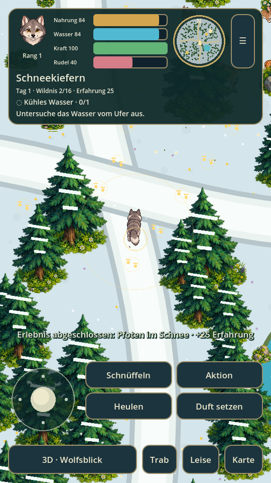
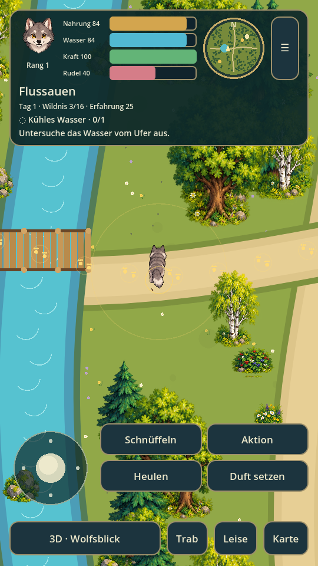

# 🐺 Wolf · Wildnis & Rudel

Ein niedliches, naturbezogenes Wolfspiel in **Godot 4.5.1**. Die erste spielbare Version verbindet eine echte **2D-Draufsicht mit freier Bewegung in alle Richtungen** mit einer **überall zuschaltbaren 3D-Sicht aus den Augen des Wolfs**.

Du beginnst als Jungwolf nahe deiner Familie. Erkunde 16 zusammenhängende Gebiete, lerne Fährten kennen und finde Wasser, Nahrung und geschützte Ruheplätze. Kein menschliches Verhalten, keine Waffen, keine grafische Gewalt.

**Stand: 0.2.0 · spielbarer Prototyp.** Noch kein vollständiger Lebenszyklus-Simulator. Die 2D-Grafik verwendet neue, an den Stilvorlagen orientierte Comic-Sprites. Die echte 3D-Welt verwendet weiterhin einfache, räumliche Modelle. Erweiterte Rudel-KI, Jagd, Jahreszeiten, Animationen und langsames körperliches Wachstum sind weitere Entwicklungsstufen.

## Spielen

- **Android:** APK aus dem [Build-Artefakt](https://github.com/chekento/wolf/actions/workflows/build.yml) herunterladen, ZIP entpacken und `Wolf-0.2.0-debug.apk` installieren. Android 7+; ARM64. Der Build benötigt keine Internetberechtigung.
- **Computer:** Repository herunterladen, `project.godot` mit Godot **4.5.1** öffnen und F6/F5 starten. Das Spiel verwendet den Compatibility-Renderer.
- **Browser:** Das Web-Artefakt enthält einen exportierten Browser-Build. Entpacken und mit einem lokalen HTTP-Server öffnen, z. B. `python3 -m http.server 8000` im Web-Ordner. `index.html` nicht direkt als lokale Datei öffnen.

Die APK wird zusätzlich direkt im zugehörigen Chat als Download bereitgestellt. CI-Artefakte stehen nach erfolgreichem Workflow zur Verfügung und können eine GitHub-Anmeldung erfordern.

## Ansichten

| 2D-Draufsicht | 3D-Wolfsblick |
|---|---|
|  |  |

Dies sind **Aufnahmen des laufenden Spiels**, keine Konzeptbilder. Beide Ansichten verwenden dieselben Gebiets-, Objekt-, Tier- und Fährtendaten. Ein Baum wechselt beim Umschalten nicht den Ort. Der Wolfsblick beginnt an derselben Position und mit derselben Blickrichtung.

## Gebiete und Spielumfang

Die Welt bildet einen zusammenhängenden **4×4-Verbund mit 16 Gebieten**. Jedes Gebiet umfasst 3200×3200 Welteinheiten. Gegenüber Version 0.1.0 ist die Gesamtfläche **16-mal so groß**. Gebietswechsel funktionieren über die Kartenränder in beiden Ansichten.

| Westen → Osten | 1 | 2 | 3 | 4 |
|---|---|---|---|---|
| Norden | Frostgrat | Schneekiefern | Wasserfalltal | Steinbockhöhe |
| Zweite Reihe | Uralter Wald | Bergwiese | Flussauen | Spiegelsee |
| Dritte Reihe | Moosruinen | Rudelhöhle | Kiefernwald | Eichenhain |
| Süden | Dünenküste | Schilfmoor | Dorfrand | Abendlichtung |

- 20 Erlebnisse und Ziele: Fährten lesen, Rudel kennenlernen, Tiere beobachten, Naturorte finden und alle Gebiete erkunden.
- Neue Comic-Bäume, vier Wolfansichten, Rehe, Hasen, Füchse, Höhle und Porträt; Schnee, Wasserfälle, Ruinen, Küste und Häuser am Dorfrand.
- Zwei Erwachsene und zwei junge Rudelwölfe. Begrüßen stärkt die Bindung; vertraute Erwachsene folgen in der Nähe.
- Schnüffeln zeigt Fährten für 18 Sekunden. Leises Gehen erleichtert die Annäherung; Beobachtung im Wolfsblick benötigt Abstand und eine freie Sichtlinie.
- Nahrung, Wasser, Kraft und Rudelbindung; Duftmarken, Erfahrung, Rang und Naturtagebuch.
- Minikarte mit Wegen und wichtigen Orten. Vergrößerbare Übersicht über alle 16 Gebiete.
- Automatisches Speichern alle 20 Sekunden, beim Gebietswechsel und beim Wechsel in den Hintergrund. Spielstände aus 0.1.0 werden übernommen.

| Schneekiefern | Flussauen |
|---|---|
|  |  |

## Steuerung

| Aktion | Android / Touch | Tastatur / Maus |
|---|---|---|
| Bewegen | Stick unten links | WASD oder Pfeiltasten |
| Umsehen in 3D | Über die Landschaft wischen | Linke Maustaste ziehen; alternativ I/J/K/L |
| Ansicht wechseln | 3D / 2D-Taste | V |
| Schnüffeln | Schnüffeln | F |
| Spuren / Wasser / Nahrung / Wegstein / Tier untersuchen | Aktion | E |
| Heulen | Heulen | H |
| Ruhen nahe einer Höhle | Aktion an der Höhle / Menü → Hier ruhen | R |
| Schneller laufen | Trab umschalten | Umschalt halten |
| Leise gehen | Leise umschalten | Touch-Schaltfläche |
| Duftmarke | Duft setzen | Touch-Schaltfläche |
| Gebietskarte | Karte | M |
| Menü / zurück | ☰ / × | Escape |

Die Landschaftswischfläche liegt zwischen Kopfzeile und Steuerung, damit Kamera und Stick getrennt bedienbar bleiben. Im Wolfsblick ist die Bewegungsrichtung relativ zur Kamera.

## Warum Godot?

Godot vereint eine eigene 2D-Engine und echte 3D-Szenen in einem Projekt, bietet Android- und Web-Exporte und benötigt für diesen Prototyp keine zusätzlichen Bibliotheken. Die Compatibility-Darstellung hält den technischen Einstieg klein. Eine zentrale Weltdefinition verhindert, dass 2D und 3D auseinanderlaufen.

Die 2D-Ansicht ist ein `Node2D` mit eigenständiger Zeichnung; der 3D-Modus erzeugt dieselbe Karte als `Node3D` mit `Camera3D` in Wolfshöhe. Kein Bildfilter und keine vorgerenderte Panoramaansicht.

## Entwickeln und prüfen

```sh
godot --headless --editor --import --quit
godot --headless --script tests/smoke.gd
godot --path .
```

Der Smoke-Test prüft reproduzierbare Karten, gegenseitige Übergänge, sichere Ankunftspunkte, Speichern/Laden, Interaktionen, Sichtlinien, Kameraausrichtung, alle 16 Gebiete, Brücken, Rudelinteraktionen, Entdeckungen, Duftmarken, die Spielstandmigration und Menüwechsel. Tests verwenden eine separate Spielstanddatei, damit der echte Spielstand unberührt bleibt.

```sh
mkdir -p builds/web
godot --headless --export-debug Android builds/Wolf-0.2.0-debug.apk
godot --headless --export-release Web builds/web/index.html
```

Für Android: passende Godot-Exportvorlagen, JDK 17, Android SDK mit `platform-tools`, `build-tools;35.0.1` und `platforms;android-35`. Die Pfade in Godots Editor-Einstellungen unter **Export → Android** eintragen. Godot erstellt einen lokalen Debug-Schlüssel; der private Schlüssel wird nicht ins Repository übernommen. Diese APK ist zum Testen, nicht als Play-Store-Release signiert.

## Dateien

- `scripts/world_data.gd`: reproduzierbare Karten und Verbindungen
- `scripts/state.gd`: Bedürfnisse, Fortschritt, Tagebuch und Spielstände
- `scripts/main.gd`: Spielablauf, Interaktionen und Menüs
- `scripts/map_view.gd`: 2D-Draufsicht
- `scripts/atlas.gd`: Comic-Spriteatlas
- `scripts/minimap.gd`: Minikarte
- `docs/art-assets.md`: Grafikherkunft und Generierung
- `scripts/world_view.gd`: echte 3D-Welt und Kamera
- `scripts/touch_stick.gd`: Touch-/Maus-Stick
- `tests/smoke.gd`: Gameplay-Prüfungen

## Grenzen dieser Version

Noch keine Prüfung auf einem physischen Android-Gerät. Die APK wurde gebaut, signiert und technisch überprüft. Die Darstellung wurde unter Linux mit einem Software-Renderer geprüft. Die Systemwerte und das Verhalten sind spielerisch vereinfacht; Rudel-KI und Tageszeiten stehen am Anfang. Das Alter wird noch nicht als körperliches Wachstum simuliert. Für längere Spielverläufe folgen weitere Begegnungen, Szenen, Gebiete und Ziele.

Idee und Ausrichtung: KoSch / Kolja Werner Schumann. Inhaltlich angelehnt an den Wolf-Simulator: natürliches Rudelleben, nachvollziehbare Entwicklung, Entdeckungen und Geschichte aus Sicht eines Wolfs.
