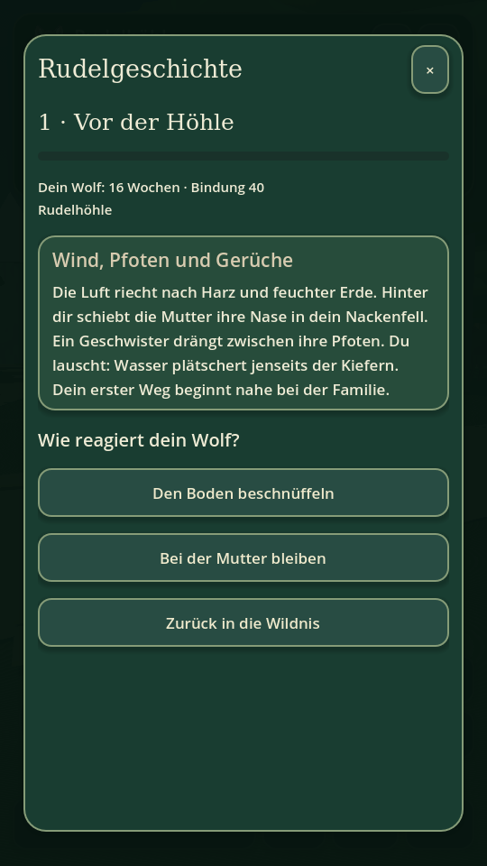
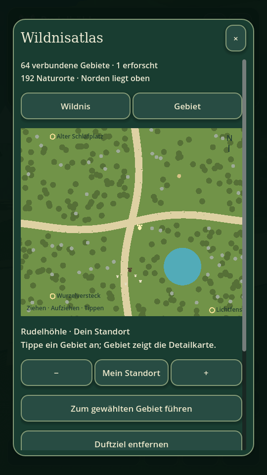

# 🐺 Wolf · Wildnis & Rudel

**0.3.0 · Die lebendige Wildnis** — ein naturbezogenes Wolfspiel für Android in Godot 4.5.1. Du beginnst als 16 Wochen alter Jungwolf bei Mutter, Vater und zwei Geschwistern. Deine Heimat erschließt du über Gerüche, Fährten, vorsichtige Beobachtungen und gemeinsame Wege.

Eine frei begehbare **2D-Draufsicht** verbindet sich mit einer **überall zuschaltbaren echten 3D-Sicht in Wolfshöhe**. Beide Ansichten verwenden dieselben Objekte, Tierpositionen und Spuren. Die Comic-Grafik orientiert sich an KoSchs Stilvorlagen und dem Wolf-Simulator: natürliche Tiere, Rudelleben, langsame Entwicklung und zusammenhängende Geschichten.

## Spielen & Download

- **Android 7+ / ARM64:** [aktueller Build auf GitHub Actions](https://github.com/chekento/wolf/actions/workflows/build.yml). Nach erfolgreichem Lauf das Artefakt herunterladen, ZIP öffnen und `Wolf-0.3.0-debug.apk` installieren. Die geprüfte APK wird zusätzlich direkt im Chat als Download ausgegeben.
- **Computer:** `project.godot` mit Godot **4.5.1** öffnen und starten. Der Compatibility-Renderer benötigt keine weiteren Bibliotheken.
- **Browser:** Web-Artefakt entpacken und im Web-Ordner einen HTTP-Server starten: `python3 -m http.server 8000`. Danach `http://localhost:8000` öffnen.

Die App benötigt keine Internetberechtigung. Der Spielstand liegt lokal. Das ist eine Debug-APK zum Testen.

## Echte Spielaufnahmen

| Draufsicht | Wolfsblick |
|---|---|
|  |  |

| Rudelgeschichte | Gebietsdetailkarte |
|---|---|
|  |  |

Die Bilder zeigen das laufende Godot-Spiel unter Linux mit Software-Rendering.

## Eine deutlich größere Welt

**64 verbundene Gebiete im 8×8-Verbund**, jeweils 3200×3200 Welteinheiten. Die Gesamtfläche ist **viermal so groß wie in 0.2.0** und **64-mal so groß wie in 0.1.0**. Alle Gebiete sind über ihre Kartenränder erreichbar. Die IDs und lokalen Koordinaten der bisherigen 16 Gebiete bleiben erhalten.

Die ursprüngliche Heimat liegt in der Mitte. Darüber und darum erstrecken sich Frostküste, Tundra, Tannenpässe, Nebel- und Wurzelwälder, Biberteich, Weidenbach, Sonnengrat und weitere Landschaften. **192 Naturorte** verteilen sich auf Wälder, Schnee, Berge, Küste, Moor und Wiesen. Flüsse haben Übergänge; eine Sandbank hält den neuen Zugang zur Dünenküste begehbar.

Der **Wildnisatlas** lässt sich ziehen und mit zwei Fingern oder den Tasten vergrößern. Die Detailkarte zeigt tatsächliche Bäume, Wasser, Höhlen und benannte Naturorte. Tippe ein Gebiet oder einen Punkt als **Duftziel** an: die Karte zeigt eine Gebietsroute und der Kompass führt zum nächsten Übergang. Die Karte teleportiert deinen Wolf nicht. Unerkundete Gebiete sind gedämpft; Gebietsnamen können in den Einstellungen eingeblendet werden.

## Rudelleben & Erlebnisse

- **Neun zusammenhängende Kapitel** mit kleinen natürlichen Entscheidungen. Kapitel werden durch echte Erlebnisse wie Trinken, Fährtenlesen, Rudelkontakt und Tierbeobachtung freigeschaltet.
- Begrüßen, Heulen, gemeinsames Erkunden, Spiel- und Ruheverhalten. Ab **Bindung 48** kann die Mutter dich auch in andere Gebiete begleiten.
- **26 Erlebnisse**, verfolgbares Ziel, Erfahrung und Ränge; Nase, leise Pfoten und Rudelerfahrung entwickeln sich mit deinen Handlungen.
- Reh-, Hasen- und Fuchsspuren mit unterscheidbaren Trittsiegeln. Fährten führen zu den Aufenthaltsorten der Tiere. Schnüffeln macht sie sichtbar; eine geübtere Nase verlängert die Anzeige.
- Rehe, Hasen und Füchse wandern, lauschen und fliehen bei zu naher Annäherung. Leises Gehen und Abstand helfen bei der Beobachtung. In 3D braucht die Beobachtung einen freien Blick auf das Tier.
- Nahrung, Wasser, Kraft und Rudelbindung; geschützte Ruheplätze und Duftmarken.
- **Ein Spieltag dauert 60 Minuten aktiver Spielzeit.** Menüs pausieren die Welt. Ruhen überspringt keine Tage. Alter und Körpergröße nehmen langsam mit vergangenen Tagen zu.
- Naturtagebuch mit bis zu 300 Einträgen und Filtern; ein kleiner Tier- und Fährtenführer.

## Grafik, Modelle & Animation

Die Draufsicht nutzt neue Comic-Laufsequenzen für Wolf, Reh, Hase und Fuchs. Der Wolf zeigt zusätzlich Schnüffeln, Heulen, eingerolltes Ruhen und einen Spielbogen. Fußspuren bleiben kurz im Boden sichtbar.

Die 3D-Tiere bestehen aus eigenen farbigen Meshes mit beweglichen Beinen, Knien, Kopf, Ohren und Schwanz. Laufanimationen folgen der zurückgelegten Strecke; Ruhe-, Spiel-, Schnüffel- und Heulposen reagieren auf das Verhalten. Eigene Baum- und Felsmeshes, Bodenoberflächen, sanfte Hügel, durchgehende Pfade, Schatten und Licht nach Tageszeit ergänzen die Wildnis. Schnee, Regen und Nebel werden in beiden Ansichten dargestellt.

Die 3D-Welt wird während der Draufsicht erst beim Umschalten aufgebaut. Neue Menüs mit lesbaren Karten, Familienansicht, einklappbarer Kopfleiste und kontextabhängiger Aktion halten den Bildschirm übersichtlich. Naturklang, Wetter, ruhige Animationen und Draufsichtzoom sind einstellbar.

Grafikherkunft, Prompts und Schriftlizenz: [docs/art-assets.md](docs/art-assets.md).

## Steuerung

| Aktion | Android | Computer |
|---|---|---|
| Bewegen in alle Richtungen | Pfotenstick | WASD / Pfeile |
| 3D umsehen | Über die Landschaft wischen | Maus ziehen / I J K L |
| Ansicht wechseln | 3D / 2D | V |
| Schnüffeln | Schnüffeln | F |
| Spur, Wasser, Tier, Naturort | Kontextaktion | E |
| Heulen | Heulen | H |
| Ruhen nahe einer Höhle | Aktion / Menü | R |
| Trab | Trab umschalten | Umschalt halten |
| Leise gehen | Leise umschalten | Schaltfläche |
| Rudelgeschichte | Geschichte | Schaltfläche |
| Karte | Karte / Minikarte antippen | M |
| Menü / zurück | ☰ / × | Escape |

## Spielstände & Prüfungen

Automatisches Speichern alle 20 Sekunden, beim Gebietswechsel und beim Wechsel in den Hintergrund. Spielstandformat 3 übernimmt die Fortschritte aus 0.1.0 und 0.2.0; Gebiets-IDs bleiben stabil. Tiere und Positionen besuchter Gebiete werden während einer Sitzung beibehalten, beim App-Neustart wird die Tierwelt neu aufgebaut.

```sh
godot --headless --editor --import --quit
godot --headless --script tests/smoke.gd
mkdir -p builds/web
godot --headless --export-debug Android builds/Wolf-0.3.0-debug.apk
godot --headless --export-release Web builds/web/index.html
```

Die Prüfungen decken alle 64 Gebiete, gegenseitige Übergänge, begehbare Ankunftsorte, Wasserzugänge, Sichtlinien, Story-Freigaben, langsames Altern, Begleitung ohne doppelte Elternwölfe, Gelenkposen, Karteninput, Menüs und Spielstandübernahme ab. Test- und Aufnahme-Skripte verwenden eigene Spielstanddateien.

Android-Export: passende Godot-Exportvorlagen, JDK 17, Android SDK mit `platform-tools`, `build-tools;35.0.1` und `platforms;android-35`. Private Signierschlüssel bleiben außerhalb des Repositorys.

## Entwicklungsstand

Spielbarer Prototyp, technisch geprüfte und signierte APK. Noch kein Test auf einem physischen Android-Gerät. Die Darstellung und Animationen wurden im laufenden Linux-Spiel geprüft. Noch kein vollständiger Lebenszyklus mit Partnersuche, eigener Nachwuchspflege, kooperativer Jagd oder dynamischen Jahreszeiten; Verhalten, Bedürfnisse und Fährten sind spielerisch vereinfacht. Der Web-Export wird vom Build-Workflow erstellt; diese Version wurde lokal als Android-APK geprüft.

Idee und Ausrichtung: **KoSch / Kolja Werner Schumann**.
