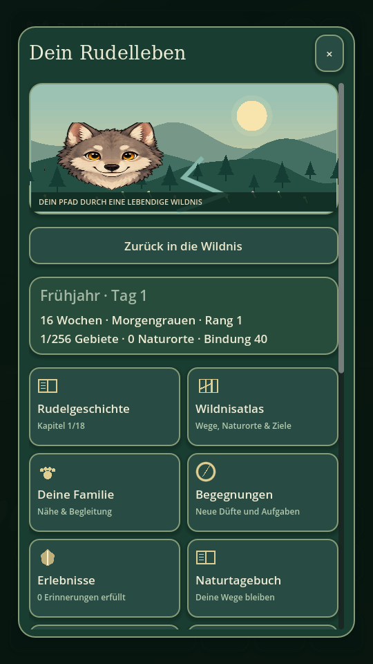

# 🐺 Wolf · Wildnis & Rudel

**0.7.0 · Lebendige Wege** — ein offline spielbares Wolfspiel für Android in Godot 4.5.1. Du beginnst als 16 Wochen alter Jungwolf bei Mutter, Vater und zwei Geschwistern. Gerüche, Fährten, vorsichtige Beobachtungen und gemeinsame Wege erschließen deine Heimat.

Frei begehbare **2D-Draufsicht**, **echter 3D-Wolfsblick** und eine neue **3D-Folgekamera** teilen Landschaften, Tierpositionen und Spuren. Eigene Comic-Grafik und Tiermodelle verbinden sich mit friedlichen Rudelgeschichten und langsamer natürlicher Entwicklung.

## Spielen & Download

- **Android 7+ / ARM64:** Die signierte `Wolf-0.7.0-debug.apk` wird direkt im Chat bereitgestellt. [GitHub Actions](https://github.com/chekento/wolf/actions/workflows/build.yml) erstellt zusätzlich Android- und Web-Artefakte. Debug-Builds mit lokalem Spielstand und ohne Internetberechtigung.
- **Computer:** `project.godot` mit Godot **4.5.1** öffnen und starten.
- **Browser:** Web-Artefakt entpacken, im Web-Ordner `python3 -m http.server 8000` starten und `http://localhost:8000` öffnen.

**Installation gegenüber 0.3.0:** Der frühere lokale Debug-Schlüssel war nicht mehr verfügbar. Seit 0.4.0 wird ein dauerhaft gesicherter Schlüssel verwendet. Die lokale 0.7.0 setzt diese Signatur von 0.4.0 bis 0.6.0 fort; Android erlaubt damit weiterhin kein direktes Update über 0.3.0. Einen vorhandenen Spielstand vor jeder Deinstallation sichern; siehe [Installationshinweise](docs/android-install.md). Spätere lokal ausgelieferte Builds verwenden denselben Schlüssel. Actions-Builds erhalten einen eigenen temporären Debug-Schlüssel.

## Neu in 0.7.0

Tiere beenden ihre wirklichen Wege zu Nahrung, Deckung und Trinkufer und bleiben dort für eine artspezifische Zeit. Eine lange Strecke wird nicht mehr durch einen globalen Zeitwechsel unterbrochen. Rehe nutzen nahe gemeinsame Futterplätze, wenn ein freier Weg existiert; eine nahe Fluchtreaktion erreicht die kleine Gruppe und klingt nach Ende der Gefahr wieder ab. Geschwister wechseln kurze gemeinsame Laufspiele mit echten Ruhepausen ab.

Zwei neue Begegnungen verlangen tatsächliche gemeinsame Ankunft mit dem Elternwolf an zwei Orten beziehungsweise die Beobachtung desselben Tieres bei zwei unterschiedlichen ruhigen Tätigkeiten. Nur aktive Sekunden, wirkliche Zielankunft und freie Sicht zählen. Das Spiel zeigt draußen den Fortschritt sowie Hinweise bei Bewegung, Aufregung, fehlender Elternnähe oder verlorenem Blickkontakt. Ein näher vorbeikommendes Tier übernimmt nicht die gewählte Beobachtung.

**Große Karte** vergrößert den Wildnisatlas auf den verfügbaren Bildschirm. Beim Wechsel zur Ortsliste bleiben Gebiet, Zoom, geografischer Ausschnitt, Ebenen und Duftziel erhalten. Rückkehr ins Spiel, Standort, Ziele und Ebenen bleiben ohne Scrollen erreichbar.

Unregelmäßigere Baumkronen, geneigte Äste, gebogene Gräser, Farnbüschel und Waldlaub geben der Landschaft mehr Vielfalt. Baum-Bodenschatten werden in vorhandenen 2D-Bodenabschnitten wiederverwendet. Eigene Fell- und Gesichtsdetails erweitern die Tiermodelle bei gleichbleibender Gelenkzahl. Die NPC-Schrittweite passt jetzt zur tatsächlich gegangenen Strecke; in 2D senkt Grasen die Schnauze richtig zum Boden.

## Neu in 0.6.0

Rehe, Hasen, Füchse und Wölfe wählen wirkliche Futterplätze, Deckung und trockene Trinkufer. Aufmerksamkeit, Fluchtdistanz und Tagesaktivität unterscheiden sich nach Art. Tiere fliehen über freie Wege in die Deckung, beruhigen sich dort und kehren zu ihrer Routine zurück. Eine Begrüßung führt zu einer kurzen freundlichen Reaktion des Rudels.

Vier weitere Begegnungen entstehen aus tatsächlichen Handlungen: erst trinken, dann am gewählten Platz fressen und zuletzt geschützt ruhen; zwei bestimmte Tierarten beobachten; dasselbe ruhige Tier zwölf aktive Sekunden im Blick behalten; einen Naturort prüfen und dort den eigenen Duft setzen. Die Aufgaben zeigen ihre nächsten Schritte. Annehmen und Belohnung stehen direkt unter dem Bild; im Menü pausiert die Beobachtungszeit.

Die Gebietskarte zeichnet sichere Wege um Felsen und über vorhandene Brücken. Kompass und Pfotenschritte folgen diesem Weg. Naturorte, gelesene Spuren und Wegführung lassen sich einzeln anzeigen; Gebietsausgänge und die Liste der sechs lokalen Naturorte erleichtern die Orientierung. Aufziehen bleibt am Punkt zwischen den Fingern verankert. Im Menü führt **Sichere Wege** zu Wasser, Nahrung, Schutz oder zur Heimat.

## Neu in 0.5.0

Die kompakte, gespeicherte Kopfleiste schafft mehr Platz für die Wildnis; Bedürfnisse, Begegnungen und Kamera bleiben erreichbar. Der Einstieg bietet einen sofort sichtbaren Startknopf und ein echtes Trinkufer-Ziel. Angenommene Fährten-, Naturort- und Wasser/Ruhebegegnungen führen nach Fortschritten zum nächsten tatsächlichen Schritt. Zwei Finger können unabhängig bewegen und umsehen; Touch-Duplikate und alte Kamerapointer nach Ansichtwechseln werden abgefangen.

Elternwölfe gehen um Hindernisse und nutzen vorhandene Flussübergänge. Am Abend läuft die Familie zu ihrem Ruheplatz zurück; Rehe, Hasen und Füchse haben unterschiedliche Aktivitätsphasen. Es gibt keinen Fang-Teleport für die Begleitung.

Statische Bodenmalerei und Blumen werden in der Draufsicht zusammengefasst. In 3D teilen Baumgruppen individuelle Farben; entfernte Kronen und Steine nutzen weniger Dreiecke. Der Boden und die Tierfarben werden für den Android-Renderer korrekt abgestimmt. Muscheln, Pilze, Schilf, Treibholz, Zapfen und Steinstapel unterscheiden die Naturorte nach Landschaft. Naturklang startet beim Zurückkehren ins Spiel; Menüs und App-Hintergrund stoppen die Wiedergabe zuverlässig.

## Echte Spielaufnahmen

| Draufsicht | Neue Folgekamera |
|---|---|
|  |  |

| Menü | Wildnisatlas |
|---|---|
|  |  |

Die Bilder zeigen das laufende Godot-Spiel unter Linux mit Software-Rendering.

## 256 verbundene Gebiete

Die Welt umfasst **16×16 Gebiete** mit jeweils 3200×3200 Welteinheiten: **vierfache Fläche gegenüber 0.3.0**, sechzehnfache gegenüber 0.2.0. Die bisherigen 64 Gebiets-IDs und lokalen Koordinaten bleiben erhalten; die ursprüngliche Heimat liegt weiter in der Mitte.

**1536 benannte Naturorte**, sechs pro Gebiet, liegen in Wald, Schnee, Bergen, Küste, Moor und Wiesen. Jedes Gebiet enthält Nahrung, Wasser und geschützte Ruheplätze. Wegeprüfungen kontrollieren tatsächliche Zugänge zu Naturorten, Ressourcen, Wegsteinen und Fährten. Fünfzehn Wildtiere pro Gebiet und die Familie in der Heimat bewegen sich durch die Landschaft.

Der **Wildnisatlas** zeigt Landschaftssymbole, Höhenlinien, Gewässer, Kompass und Maßstab. Ziehen, Aufziehen und Gebietssuche erleichtern die Orientierung. Die Detailkarte zeigt tatsächliche Vegetation, Wasser, Höhlen, Naturorte und Tierpositionen. Antippen setzt ein **Duftziel**; Route und Kompass führen zu den nächsten Übergängen. Unerkundete Gebiete bleiben gedämpft. Kein Karten-Teleport.

## Rudelleben & Erlebnisse

- **18 zusammenhängende Kapitel** mit natürlichen Entscheidungen und Freigaben durch tatsächliche Erlebnisse.
- **40 Erlebnisse** und wiederholbare regionale **Wildnisbegegnungen**: neue Fährten, Naturorte, eigene Wege, Nachbargebiete, Tierbeobachtung, Trinken und Ruhen oder vertraute Rudelrufe. Alte Handlungen erfüllen keine neu angenommene Aufgabe. Belohnungen lassen sich einmal abholen.
- Fünf Tagesroutinen für Mutter, Vater und Geschwister. Begrüßen, Heulen, Erkunden, Spielen und Ruhen stärken die Bindung. Ab Bindung 48 kann die Mutter dich über Gebietsgrenzen begleiten.
- Reh-, Hasen- und Fuchsspuren mit unterscheidbaren Trittsiegeln. Schnüffeln macht sie sichtbar; eine geübte Nase verlängert die Anzeige.
- Tiere wandern, lauschen und fliehen bei zu naher Annäherung. Beobachten in 3D benötigt Abstand, Blickrichtung und freie Sicht.
- Nahrung, Wasser, Kraft, Rudelbindung, Duftmarken und Naturtagebuch mit Filtern.
- **Ein Spieltag dauert 60 Minuten aktiver Spielzeit.** Menüs und App-Hintergrund pausieren die Entwicklung. Ruhen überspringt keine Tage. Alter und Körpergröße wachsen allmählich; Jahreszeiten wechseln nach jeweils 30 Spieltagen.

## Grafik & Animation

Eigene 3D-Tiermodelle unterscheiden Wolf, Reh, Hase und Fuchs durch Körperbau, Schnauze, Ohren, Fell und Gliedmaßen. Bewegliche Knie, Kopf, Ohren, Kiefer und Schwanz verbinden sich mit weich überblendeten Lauf-, Ruhe-, Spiel-, Schnüffel- und Heulposen. Die Folgekamera zeigt den eigenen wachsenden Wolf und verkürzt ihren Abstand bei Hindernissen.

Gräser, Farne, Schilf, Blumen, liegendes Holz und zusätzliche Naturortmodelle verdichten die Landschaft. Jahreszeitliche Farben, bewegtes Wasser, eigener Himmel mit Wolken, Mond und Sternen sowie mehrschichtiger Regen, Schnee und Nebel ergänzen die Wildnis. Die Draufsicht verwendet Comic-Laufsequenzen, Aktionsposen und Bodenschatten.

Illustrierte Menüs, Familienroutinen, Begegnungsfortschritt, Karten und Tierwissen sind scroll- und touchfähig. Naturklang, Wetter, ruhige Animationen, weiche 3D-Kanten und Kartenansicht sind einstellbar. [Grafikherkunft und Schriftlizenz](docs/art-assets.md).

## Steuerung

| Aktion | Android | Computer |
|---|---|---|
| Bewegen | Pfotenstick | WASD / Pfeile |
| 3D umsehen | Landschaft wischen | Maus ziehen / I J K L |
| Ansicht wechseln | 3D / 2D | V |
| 3D-Kamera wechseln | Wolfsblick / Folgekamera | Schaltfläche |
| Schnüffeln | Schnüffeln | F |
| Spur, Wasser, Tier, Naturort | Kontextaktion | E |
| Heulen | Heulen | H |
| Ruhen nahe einem Schutzplatz | Aktion / Menü | R |
| Trab | Trab umschalten | Umschalt halten |
| Karte | Karte / Minikarte | M |
| Menü / zurück | ☰ / × / Android-Zurück | Escape |

## Spielstände & Entwicklung

Spielstandformat 4 übernimmt Fortschritte aus 0.1–0.3. Automatisches Speichern erfolgt alle 20 Sekunden, beim Gebietswechsel und beim Wechsel in den Hintergrund. Der Hauptspielstand wird atomar ersetzt. Begegnungen und tatsächliche Aktionszähler werden mitgespeichert. Ein begrenzter Sitzungscache und kompakte Tierpositionen erhalten besuchte Tierwelten über Cache-Verdrängung und App-Neustarts.

```sh
godot --headless --editor --import --quit
godot --headless --script tests/smoke.gd
godot --headless --script tests/gameplay_expansion.gd
godot --headless --script tests/graphics_expansion.gd
godot --headless --script tests/ui_expansion.gd
godot --headless --script tests/animal_behavior.gd
godot --headless --script tests/atlas_expansion.gd
godot --headless --script tests/ecology_expansion.gd
godot --headless --script tests/encounter_controls.gd
godot --headless --script tests/locomotion_expansion.gd
godot --headless --script tests/living_world.gd
godot --headless --script tests/landscape_expansion.gd
godot --headless --script tests/atlas_observation.gd
mkdir -p builds/web
godot --headless --export-debug Android builds/Wolf-0.7.0-debug.apk
godot --headless --export-release Web builds/web/index.html
```

Ein wiederholbarer Grafikvergleich benötigt ein sichtbares Godot-Fenster:

```sh
godot --audio-driver Dummy --script tools/profile_rendering.gd -- /tmp/wolf-profile
```

Er misst fünf feste Szenen mit ausgeblendeter Oberfläche, je 20 Aufwärm- und 80 Messbildern, und speichert Bilder sowie JSON-Messwerte. Messergebnisse des Software-Renderers sagen keine Android-Gerätebildrate voraus.

Android: Godot-4.5.1-Exportvorlagen, JDK 17, Android SDK mit `platform-tools`, `build-tools;35.0.1`, `platforms;android-35`. Package `cloud.kosch.wolf`, ARM64, minSdk 24, targetSdk 35. Private Signierschlüssel bleiben außerhalb des Repositorys. [Entwicklungsübergabe](docs/development-handoff.md) und [Prüfbericht](docs/validation-0.7.0.md) beschreiben den tatsächlich geprüften Stand mit 2750 Prüfungen.

Spielbarer Prototyp. Noch kein Test auf einem physischen Android-Gerät und noch kein vollständiger Lebenszyklus mit Partnersuche, eigener Nachwuchspflege oder kooperativer Jagd. Bedürfnisse und Tierverhalten bleiben spielerisch vereinfacht.

Idee und Ausrichtung: **KoSch / Kolja Werner Schumann**.
