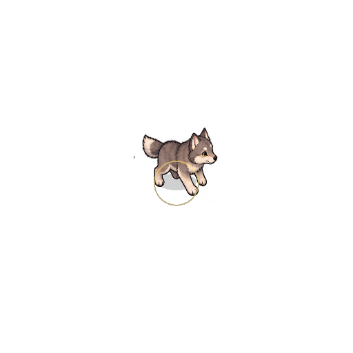
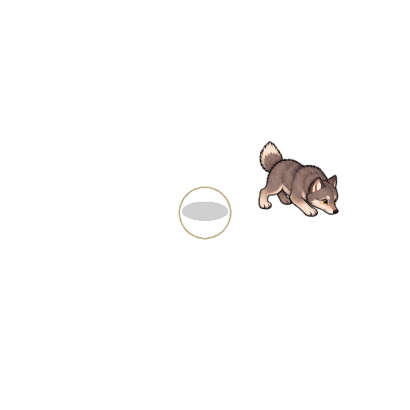
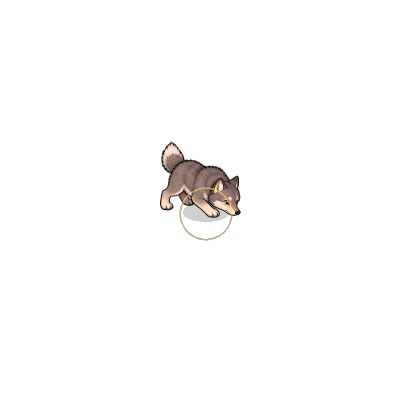
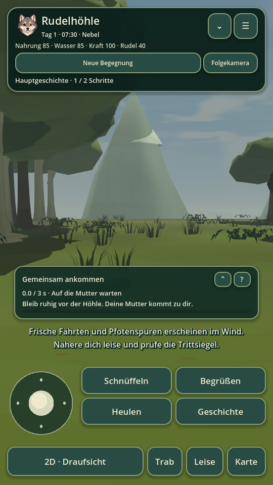
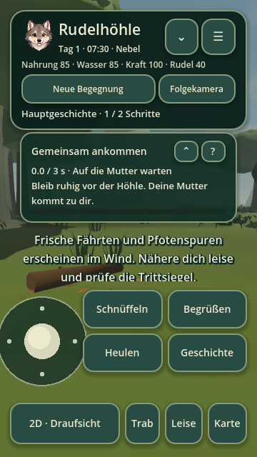

# Validierung · Wolf 0.10.0

8. Oktober 2026; Godot 4.5.1.stable.official.f 62 fdbde 1. Frisch gelesene Basis main `55ec9e8732280e9b85c9085e0d410f1db1bea997`, isolierter Checkout `wolf-next-10`. Fünf bestehende Agenten bearbeiteten Mission, unabhängigen echten Controllerdurchlauf, Rudelinteraktionen, Aktionsdarstellung und mobile Oberfläche. Root integrierte, prüfte alle Bereiche, exportierte und signierte.

## Tatsächlicher Schlusslauf

**27 Suiten, 3513 bestandene Prüfungen**, Exit 0. Der vollständige zentrale Schlusslauf und Editorimport sind ohne Script-/Enginefehler, Warnungen oder Ressourcenlecks. Jede Suite verwendet einen neuen getrennten Datenordner. [Maschinelle Einzelwerte](validation-0.10.0.json).

| Suite | Prüfungen | Ergebnis |
|---|---:|---|
| smoke | 2220 | bestanden |
| gameplay_expansion | 138 | bestanden |
| graphics_expansion | 75 | bestanden |
| ui_expansion | 52 | bestanden |
| animal_behavior | 20 | bestanden |
| atlas_expansion | 25 | bestanden |
| ecology_expansion | 63 | bestanden |
| encounter_controls | 25 | bestanden |
| locomotion_expansion | 40 | bestanden |
| living_world | 58 | bestanden |
| landscape_expansion | 11 | bestanden |
| atlas_observation | 25 | bestanden |
| path_expansion | 31 | bestanden |
| animation_expansion | 56 | bestanden |
| main_story | 92 | bestanden |
| main_story_controls | 36 | bestanden |
| story_journey | 41 | bestanden |
| habitat_details | 40 | bestanden |
| animal_detail | 45 | bestanden |
| nature_journeys | 82 | bestanden |
| nature_journey_controls | 20 | bestanden |
| nature_journey_integration | 67 | bestanden |
| action_anchors | 28 | bestanden |
| main_story_first_mission | 66 | bestanden |
| hud_layout | 70 | bestanden |
| pack_interactions | 47 | bestanden |
| first_mission_controller | 40 | bestanden |

Die bisherigen Prüfungen für alle 256 Regionen, Hauptgeschichte, Naturreisen, Save-Migration 1–4, Naturorte, Fährten, Tierbeobachtung, Atlasbedienung, natürliche Altersentwicklung, Geländekontakt und Animationen bestehen ebenfalls. Der Weltgenerator-Fingerabdruck bleibt `681fd8f2d02213bd55029cfbfc777b3038bd535b1cd6459c049545340cc4f283`. Save-Version 4, alte Weltkoordinaten, verdiente Kapitel/Sekunden und Offline-Spiel bleiben erhalten.

## Reproduzierte erste Mission und wirklicher Abschluss

Der unveränderte 0.9-Controller reproduzierte den gemeldeten Stillstand: vom frischen Spawn tatsächlich zur bewegten Mutter laufen, regulär begrüßen und zum sichtbaren südlichen Höhleneingang gehen. Der Zustand blieb nach 15 aktiven Wartesekunden bei 1/2 und 0 Sekunden. Escort war aus; das alte östliche Ziel lag 176,48 Welteinheiten entfernt und war vom tatsächlichen Eingang nicht frei mit der Mutter verbunden.

Der neue lokale Heimatstopp führt zum trockenen südlichen Eingang `(1580,2320)` und wertet Nähe innerhalb 260 Einheiten um den Höhlenmittelpunkt `(1580,2180)`. Nur dieser erste Heimatstopp benötigt keinen verborgenen Escortschalter. Die echte erwachsene Mutter muss selbst in die Nähe gehen, höchstens 1 Einheit/s schnell sein, weniger als 150 Einheiten vom Spieler und weniger als 300 vom Höhlenmittelpunkt entfernt stehen. Der physische Weg zwischen beiden muss frei sein. Erst drei aktive ruhige Sekunden schließen den Schritt ab. Spätere gemeinsame Reisen verlangen weiterhin ausdrücklich angenommene Begleitung.

`first_mission_controller` absolviert zwei echte Controllerabläufe: frischer Spielstart ohne Escort und ein tatsächlich unter 0.9 durch Begrüßung verdientes 1/2-Save mit regulär angenommener Begleitung. Es setzt weder Spieler-/Tierpositionen noch Storycheckpoints, sondern benutzt Stick, Navigation und reale Menü-/Aktionsbuttons. Beide erreichen den südlichen Guidepunkt; die Mutter läuft hin, beide halten an und verdienen 3,0 Sekunden. Menüs/Hintergrund zählen nicht. Ein zunächst körperlich blockierter gehaltener Stick zählt ebenfalls nicht: der frische Ablauf enthält vier solche Ticks, der 0.9-Rücklauf zwei. Kapitelabschluss vergibt genau einmal 40 XP und 3 Rudelskillpunkte; beide Speicher-/Neustartprüfungen erhalten den Abschluss. Alter wächst nur mit tatsächlich ausgeführten aktiven Ticks.

Die zusätzliche State-Suite prüft räumliche, zeitliche, Save- und Escort-Grenzen, einschließlich anderer Regionen, bewegter/falscher Mutter, blockierter Sicht, spätere Reisegates und korrupter Werte. Ältere verdiente Zeiten bleiben erhalten; neue Live-Nähe wird nicht aus einem Save erfunden.

## Seitlicher Aktionssprung

Die Ursache war eine verschobene Rechteckposition beim Spiegeln der 2D-Atlasgrafik. Godot behandelte die negative Breite bereits als Spiegelung und zeichnete am zusätzlich verschobenen Ursprung: bei rechtsgerichteten Aktionen sprang das Bild um eine ganze 124-Pixel-Atlasbreite. Die tatsächliche Weltposition blieb dabei gleich.

Aktionsbilder werden nun mit positivem Zielrechteck um denselben Mittelpunkt gespiegelt.28 Headlesschecks prüfen Zentren, Grenzen, Zoom und unveränderte 3D-Bodenanker/Pfotenkontakte aller vier Arten. Ein zusätzlicher tatsächlicher OpenGL-Canvaslauf besteht 36 Checks für vier Richtungen und sechs Aktionen einschließlich Rückkehr zur Standpose. Kontrollierte Vorher-/Nachherbilder verwenden die tatsächlichen Spielatlanten; die kleine Änderung der sichtbaren Kontur einer Aktionspose ist kein Weltpositionssprung.

| Standpose | Alte rechtsgerichtete Schnüffelpose | Korrigierte Schnüffelpose |
|---|---|---|
|  |  |  |

Diese drei Bilder stammen ausdrücklich aus einer kontrollierten Canvas-Testszene. Die 3D-Meshes wurden in 0.10 nicht ersetzt; ihre bestehenden weichen Posen und Bodenkontakte sind weiter geprüft.

## Rudelnähe und tatsächliche Körperbewegung

Ein auf vier Familienwölfe begrenzter regionaler Planner ergänzt kurze Begrüßungen, gegenseitige Aufmerksamkeit, kleine gemeinsame Begegnungen und vorhandene Geschwisterspiele. Ruhige Heimatankunft hat Vorrang; Begleitung bleibt eine echte Bewegung über begehbares Gelände. Getrennte Näheziele und reservierte lokale Pfadpunkte vermeiden das Zusammenlaufen im Spielerkörper. Spieler und Rudeltiere prüfen jeden tatsächlichen Schritt gegen vorhandene Körper; ältere überlappende Cachezustände dürfen sich nur durch ehrlich gelaufene trennende Schritte lösen.

Drückt der Spieler gegen einen Rudelwolf, geht dieser für kurze Zeit seitlich zu einem freien Punkt. Der Eintritt in ein neues Gebiet wählt bereits beim ersten Platzieren körperlich freies Gelände, auch für einen erwachsenen Spieler. Laufende Tiere werden zum Aufholen nicht versetzt.47 neue Checks prüfen echte Schritte, Zielankunft, Körperabstand, blockierte Eingabe, Ausweichen und begrenzte Arbeit;20 bestehende Tiercontrollerchecks bestehen einschließlich der neuen Eintrittsgrenzen.

Ein früher 0.10-Volltest fand eine falsche Blickzielzuweisung nach einer Begrüßung: die Mutter hatte ihre Routine wieder aufgenommen, richtete ihren gemeldeten Zielpunkt aber noch auf den Spieler. Die globale Zuweisung wurde entfernt; nur ausdrückliche Nähe-/Socialreaktionen schauen zum Spieler. Der unveränderte Nacht-Routinetest und die komplette Ecology-Suite bestehen im Schlusslauf. Fehlgeschlagene Zwischenläufe sind nicht in der Prüfzahl enthalten.

## Tatsächlich gerenderte Oberfläche

Der Missionskasten ist standardmäßig 86 Pixel hoch, einklappbar und zeigt Titel, kurze Bedingung und echte Sekunden. Längere Erklärungen stehen über **?** in der scrollbaren Missionsansicht. Der Header wiederholt nicht mehr den gesamten Auftrag. Meldungen besitzen eine eigene begrenzte dreizeilige Fläche; Modalansichten blenden Kasten und Meldung aus und stellen sie nach dem Schließen wieder her. Passiver Panelbereich blockiert keine Landschaftsgesten.

70 tatsächliche Layout-/Bedienchecks prüfen 540×960,432×768 und 360×640: Textflächen, Tasten, Headerabstand, ausgeklapptes Panel, Meldungsfläche, Details und Rückkehr. Fünf neue OpenGL-Aufnahmen zeigen eingeklappt, ausgeklappt, Details, Rückkehr mit Meldung und kleine 360×640-Darstellung. Alle wurden angesehen. Zusätzlich wurden 22 bestehende Menü-/Karten-/Spielbilder neu gerendert und geprüft. Aufnahmehilfen, Test-Fixtures und Dokumentation sind aus beiden Spiel-Exports ausgeschlossen. In den vollständigenGL-Logs ist ausschließlich die erwartete Software-VSync-Warnung erlaubt.

| Kompakte Mission und Meldung | Ausgeklappt | Kleine Ansicht 360×640 |
|---|---|---|
|  |  |  |

## Android und Web

Lokaler Export bestanden: **Wolf-0.10.0-debug.apk**, 32,384,504 Bytes, SHA 256 `ecdb4755f3f3a921af7291bb1addeb0b8599ccf03ebd41c3cff783c0fe8ac404`. Dauerhaft gespeicherte Datei `libfile_8566959706f08191b8f73e9fa8d0e0ad`.

Signatur v 2/v 3 geprüft; Zertifikat `08b255aa8a68369a40d089d7a5bb0e0c5e058d6ddb358f9ef449630a81bd3f1c` stimmt mit den lokal bereitgestellten 0.4–0.9-Builds überein. Manifest: `cloud.kosch.wolf`, versionCode 10, minSdk 24, targetSdk 35, ausschließlich ARM 64, keine Internetberechtigung. APK-ZIP-CRC und 16-KiB-Ausrichtung bestanden. Web-Release exportiert und ZIP-CRC geprüft. Der GitHub-Workflow führt alle 27 Suiten sowie Android-/Web-Export und Signatur-/Manifest-/Ausrichtungsprüfung aus; dessen Build verwendet einen temporären Debugschlüssel.

**Kein tatsächlicher Android-Geräte- oder Emulatorstart.** Die Bilder und Controllerprüfungen laufen auf Godot/Linux, der Renderer auf Mesa-Software-GL. Touchgefühl und Geräteperformance bleiben offen. Die Grafik bleibt stilisiert; vollständiger Lebenszyklus, Partnersuche, eigener Nachwuchs und kooperative Jagd sind weiterhin nicht umgesetzt.
